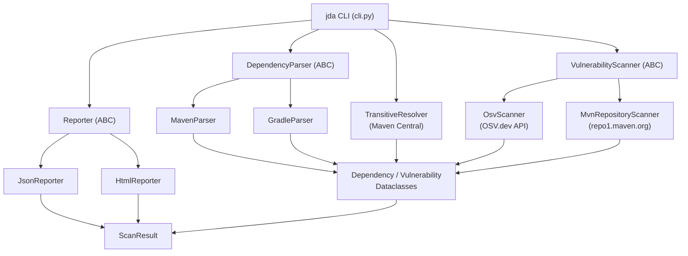

# Java Dependency Analyzer 1.0.0

> A Python CLI tool that inspects Java dependency hierarchies in Maven and Gradle projects and reports known vulnerabilities.

## Prerequisites

- Python `^3.14`
- [Poetry](https://python-poetry.org/) `2.2`

## Installation

Clone the repository and install all dependencies:

```bash
git clone <repository-url>
cd java-dependency-analyzer
poetry install
```

## Usage

```
jda [OPTIONS] FILE
```

`FILE` is the path to a `pom.xml`, `build.gradle`, or `build.gradle.kts` file to analyse.

### Options

| Option | Short | Default | Description |
|---|---|---|---|
| `--output-format` | `-f` | `all` | Report format: `json`, `html`, or `all` (both). |
| `--output-dir` | `-o` | `.` | Directory to write the report file(s) into. |
| `--no-transitive` | | `false` | Skip transitive dependency resolution; analyse direct dependencies only. |
| `--verbose` | `-v` | `false` | Print progress messages to the console. |

### Examples

Analyse a Maven POM and produce both JSON and HTML reports in the current directory:

```bash
jda pom.xml
```

Analyse a Gradle build file and write only an HTML report to `./reports/`:

```bash
jda build.gradle -f html -o reports/
```

Analyse direct dependencies only, with verbose output:

```bash
jda build.gradle.kts --no-transitive -v
```

## Architecture



### Components

| Component | Location | Responsibility |
|---|---|---|
| CLI | `java_dependency_analyzer/cli.py` | Entry point; orchestrates parsing, resolving, scanning, and reporting. |
| `MavenParser` | `parsers/maven_parser.py` | Parses `pom.xml`, resolves `${property}` placeholders, filters by runtime scope. |
| `GradleParser` | `parsers/gradle_parser.py` | Parses Groovy DSL (`build.gradle`) and Kotlin DSL (`build.gradle.kts`) files. |
| `TransitiveResolver` | `resolvers/transitive.py` | Fetches transitive dependencies by downloading POM files from Maven Central. |
| `OsvScanner` | `scanners/osv_scanner.py` | Queries the [OSV.dev](https://osv.dev/) batch API for known CVEs. |
| `MvnRepositoryScanner` | `scanners/mvn_repository.py` | Scrapes [repo1.maven.org](https://repo1.maven.org/maven2) for vulnerability notices. |
| `JsonReporter` | `reporters/json_reporter.py` | Writes a `ScanResult` to a JSON file. |
| `HtmlReporter` | `reporters/html_reporter.py` | Renders a `ScanResult` to a styled HTML report via a Jinja2 template. |

## Development Setup

Install all dependencies (including dev tools):

```bash
poetry install
```

### Running Tests

Run the full test suite with coverage and generate an HTML report:

```bash
poetry run pytest --cov=java_dependency_analyzer tests --cov-report html
```

### Code Quality

Format and lint the source code (linter must score 10/10):

```bash
poetry run black java_dependency_analyzer
poetry run pylint java_dependency_analyzer
```

## [Changelog](CHANGELOG.md)

## Author

Ron Webb &lt;ron@ronella.xyz&gt;
