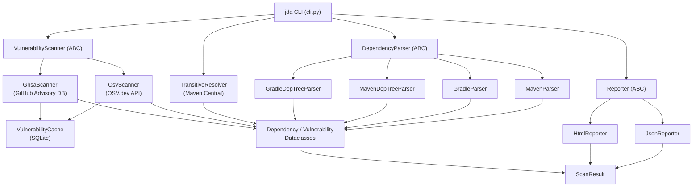

# Java Dependency Analyzer 1.0.0

> A Python CLI tool that inspects Java dependency hierarchies in Maven and Gradle projects and reports known vulnerabilities.

## Prerequisites

- Python `^3.14`
- [Poetry](https://python-poetry.org/) `2.2`

## Installation

Clone the repository and install all dependencies:

```bash
git clone <repository-url>
cd java-dependency-analyzer
poetry install
```

## Usage

```
jda <COMMAND> [OPTIONS] [FILE]
```

`COMMAND` is one of `gradle` or `maven`.

### gradle

```
jda gradle [OPTIONS] [FILE]
```

`FILE` is the path to a `build.gradle` or `build.gradle.kts` file.
Omit `FILE` when supplying `--dependencies`.

### maven

```
jda maven [OPTIONS] [FILE]
```

`FILE` is the path to a `pom.xml` file.
Omit `FILE` when supplying `--dependencies`.

### Options (both subcommands)

| Option | Short | Default | Description |
|---|---|---|---|
| `--dependencies` | `-d` | | Path to a pre-resolved dependency tree text file (see below). When supplied, parsing and transitive resolution are skipped. |
| `--output-format` | `-f` | `all` | Report format: `json`, `html`, or `all` (both). |
| `--output-dir` | `-o` | `.` | Directory to write the report file(s) into. |
| `--no-transitive` | | `false` | Skip transitive dependency resolution; analyse direct dependencies only. |
| `--verbose` | `-v` | `false` | Print progress messages to the console. |
| `--rebuild-cache` | | `false` | Delete the vulnerability cache before scanning. |
| `--cache-ttl` | | `7` | Cache TTL in days. Set to `0` to disable caching. |

### Pre-resolved dependency trees (`--dependencies`)

When a Gradle or Maven project already has a dependency tree available (e.g. from CI), you can pass it directly to skip the parser and transitive resolver:

- **Gradle**: generate with `gradle dependencies --configuration runtimeClasspath > gradle.txt`
- **Maven**: generate with `mvn dependency:tree -Dscope=runtime > maven.txt`

The report will reflect the exact tree from the file, including all transitive dependencies.

### Examples

Analyse a Maven POM and produce both JSON and HTML reports in the current directory:

```bash
jda maven pom.xml
```

Analyse a Gradle build file and write only an HTML report to `./reports/`:

```bash
jda gradle build.gradle -f html -o reports/
```

Analyse direct dependencies only, with verbose output:

```bash
jda gradle build.gradle.kts --no-transitive -v
```

Scan using a pre-resolved Gradle dependency tree (skips transitive resolution):

```bash
jda gradle --dependencies runtime.txt -f json -o reports/
```

Scan using a pre-resolved Maven dependency tree (skips transitive resolution):

```bash
jda maven --dependencies maven.txt -f json -o reports/
```

## Architecture



### Components

| Component | Location | Responsibility |
|---|---|---|
| CLI | `java_dependency_analyzer/cli.py` | Entry point (`gradle` / `maven` subcommands); orchestrates parsing, resolving, scanning, and reporting. |
| `MavenParser` | `parsers/maven_parser.py` | Parses `pom.xml`, resolves `${property}` placeholders, filters by runtime scope. |
| `GradleParser` | `parsers/gradle_parser.py` | Parses Groovy DSL (`build.gradle`) and Kotlin DSL (`build.gradle.kts`) files. |
| `MavenDepTreeParser` | `parsers/maven_dep_tree_parser.py` | Parses `mvn dependency:tree` text output into a full dependency tree. |
| `GradleDepTreeParser` | `parsers/gradle_dep_tree_parser.py` | Parses `gradle dependencies` text output into a full dependency tree. |
| `TransitiveResolver` | `resolvers/transitive.py` | Fetches transitive dependencies by downloading POM files from Maven Central. |
| `OsvScanner` | `scanners/osv_scanner.py` | Queries the [OSV.dev](https://osv.dev/) batch API for known CVEs. |
| `GhsaScanner` | `scanners/ghsa_scanner.py` | Queries the [GitHub Advisory Database](https://github.com/advisories) REST API for security advisories. |
| `VulnerabilityCache` | `cache/vulnerability_cache.py` | SQLite-backed cache for raw vulnerability API payloads with configurable TTL. |
| `DatabaseManager` | `cache/db.py` | Manages SQLite connection lifecycle and schema initialisation. |
| `JsonReporter` | `reporters/json_reporter.py` | Writes a `ScanResult` to a JSON file. |
| `HtmlReporter` | `reporters/html_reporter.py` | Renders a `ScanResult` to a styled HTML report via a Jinja2 template. |

## Development Setup

Install all dependencies (including dev tools):

```bash
poetry install
```

### Running Tests

Run the full test suite with coverage and generate an HTML report:

```bash
poetry run pytest --cov=java_dependency_analyzer tests --cov-report html
```

### Code Quality

Format and lint the source code (linter must score 10/10):

```bash
poetry run black java_dependency_analyzer
poetry run pylint java_dependency_analyzer
```

## [Changelog](CHANGELOG.md)

## Author

Ron Webb &lt;ron@ronella.xyz&gt;
